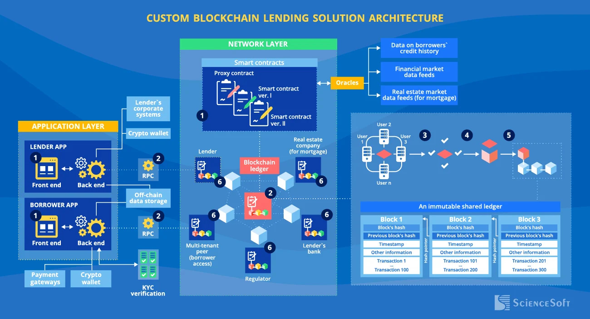
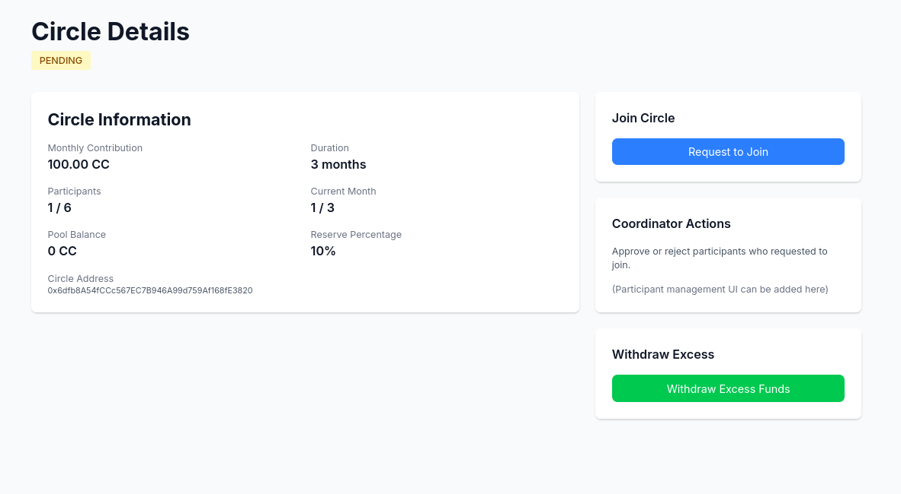
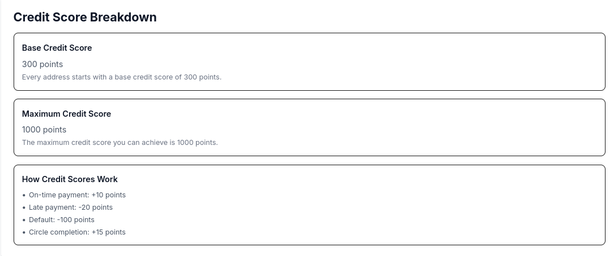
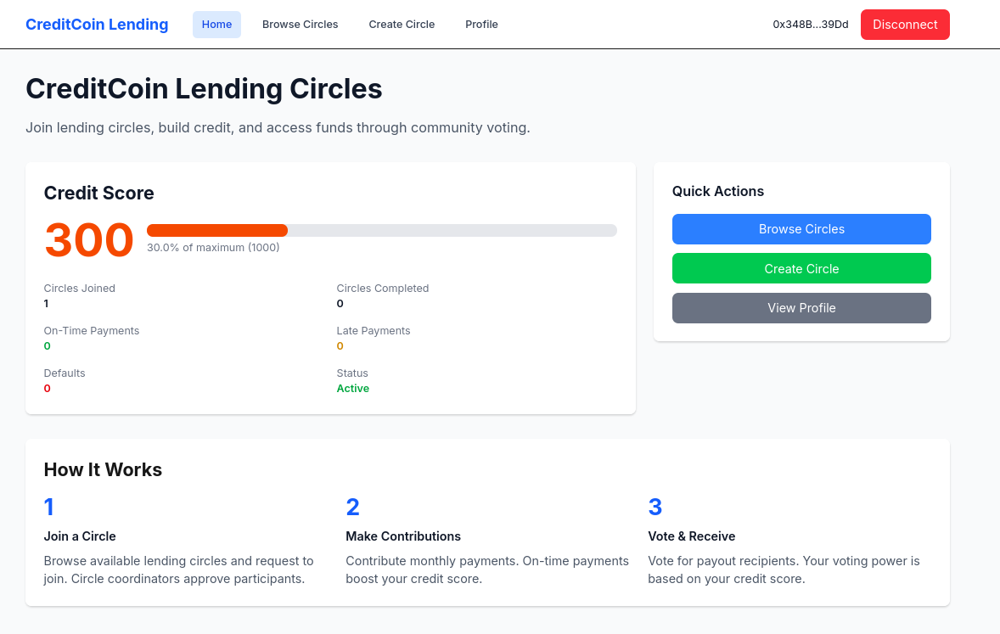
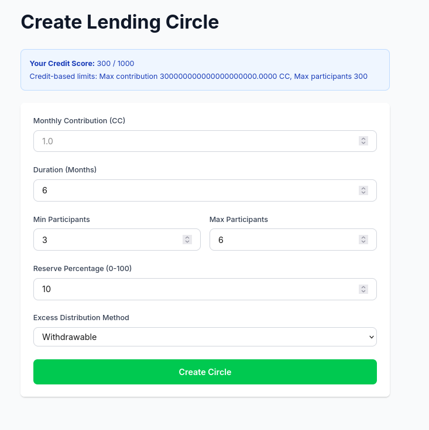

# LendingCircle - Decentralized Credit-Based Lending Circle Protocol

A comprehensive blockchain-based lending circle platform built on Ethereum that enables participants to form lending circles, make monthly contributions, and vote on payout recipients based on credit scores. The system includes full-stack implementation with smart contracts, Next.js frontend, and Node.js backend for real-time communication.

## Overview

LendingCircle is a decentralized protocol that brings traditional lending circles (also known as rotating savings and credit associations) to blockchain. Participants can create or join circles, contribute monthly payments, and vote on who receives payouts each month. The system uses credit-based scoring mechanism to ensure trust and limit risk exposure.



## Key Features

- **Credit-Based System**: All participants have credit scores (0-1000) that determine their limits and voting power
- **Weighted Voting**: Participants vote on payout recipients, with votes weighted by credit score
- **Reserve Pool**: Shared reserve pool manages risk across all circles
- **Circle Management**: Create circles with custom parameters like contribution amount, duration, and participant limits
- **Real-time Chat**: WebSocket-based chat for circle participants to discuss payouts
- **Automatic Credit Tracking**: Credit scores update automatically based on payment behavior
- **Default Handling**: Built-in mechanisms to handle late payments and defaults

## Project Structure

The project is organized into three main components:

```
LendingCircle/
├── blockchain/          # Smart contracts (Hardhat)
│   ├── contracts/      # Solidity contracts
│   ├── scripts/        # Deployment scripts
│   └── ignition/       # Hardhat Ignition modules
├── frontend/           # Next.js web application
│   ├── app/            # Next.js app router pages
│   ├── components/     # React components
│   └── lib/            # Utilities and hooks
├── backend/            # Express + WebSocket server
│   └── server.js       # Main server file
└── assets/             # Images and documentation assets
```

## Architecture

The system consists of four main smart contracts:

1. **CreditRegistry**: Tracks credit scores for all participants across the platform
2. **ReservePool**: Manages reserve funds from all lending circles
3. **LendingCircleFactory**: Factory contract that creates new lending circles
4. **LendingCircle**: Individual circle contract managing participants, contributions, and payouts



Each circle operates independently but shares the CreditRegistry and ReservePool contracts. When participants make contributions, a percentage goes to the circle pool (for payouts) and the remainder goes to the reserve pool (for risk management).

## Smart Contracts

### CreditRegistry.sol

Central registry that tracks credit scores for all participants. Credit scores start at 300 and can range from 0 to 1000. Scores get updated based on:
- On-time payments: +10 points
- Late payments: -20 points
- Defaults: -100 points
- Circle completion: +15 points

### ReservePool.sol

Manages reserve funds from all circles. Only verified LendingCircle contracts can deposit or withdraw funds. The pool provides a safety net if a circle needs additional funds for payouts.

### LendingCircleFactory.sol

Factory contract that creates new lending circles. Requires a minimum credit score of 300 to create a circle. The factory enforces credit-based limits:
- Maximum contribution per credit point: 1 ETH
- Maximum participants per credit point: 1
- Maximum exposure per credit point: 10 ETH

### LendingCircle.sol

Individual circle contract that manages:
- Participant approval/rejection
- Monthly contributions
- Voting on payout recipients
- Payout execution
- Excess fund distribution



## Frontend

The frontend is built with Next.js 14 using App Router, TypeScript, and TailwindCSS. It uses wagmi and viem for Ethereum interactions.

### Pages

- **Landing Page** (`/`): Wallet connection, credit score display, and quick actions
- **Browse Circles** (`/circles`): List all available lending circles
- **Create Circle** (`/create`): Form to create a new lending circle with validation
- **Circle Detail** (`/circles/[address]`): Full circle information, voting UI, and contribution management
- **Credit Profile** (`/profile`): Complete credit report and payment history



### Key Components

- `WalletButton`: Connect/disconnect wallet functionality
- `CreditScoreCard`: Display credit score and statistics
- `TransactionButton`: Reusable transaction button with loading states
- `VotingUI`: Complete voting interface with candidate display
- `ChatBox`: Real-time chat for circle participants



## Backend

Express.js server with WebSocket support for real-time chat functionality. Backend provides:

- **WebSocket Chat**: Real-time messaging for circle participants
- **Winner Calculation API**: Endpoint to calculate payout winners with tie-breaking logic

### API Endpoints

- `POST /api/calculate-winner`: Calculate winner for a month's payout
- `GET /api/chat/:circleAddress`: Get chat messages for a circle

### WebSocket Events

- `join`: Join a circle's chat room
- `chat`: Send a message to a circle
- `message`: Receive a message from another participant

## Getting Started

### Prerequisites

- Node.js 18+ and npm
- MetaMask or compatible Web3 wallet
- Hardhat for smart contract development
- Access to Ethereum network (local, testnet, or mainnet)

### Installation

1. Clone the repository:
```bash
git clone <repository-url>
cd LendingCircle
```

2. Install blockchain dependencies:
```bash
cd blockchain
npm install
```

3. Install frontend dependencies:
```bash
cd ../frontend
npm install
```

4. Install backend dependencies:
```bash
cd ../backend
npm install
```

### Configuration

1. **Blockchain**: Create a `.env` file in the `blockchain/` directory:
```
PRIVATE_KEY=your_private_key
RPC_URL=your_rpc_url
```

2. **Frontend**: Update contract addresses in `frontend/lib/contracts/config.ts` after deployment

3. **Backend**: Create a `.env` file in the `backend/` directory (optional):
```
PORT=3001
```

### Deployment

1. Deploy smart contracts:
```bash
cd blockchain
npx hardhat run scripts/deploy.js --network <network>
```

2. Update frontend configuration with deployed contract addresses

3. Start the backend server:
```bash
cd backend
npm start
```

4. Start the frontend development server:
```bash
cd frontend
npm run dev
```

The application will be available at `http://localhost:3000`

## Usage

### Creating a Circle

1. Connect your wallet on the landing page
2. Navigate to the "Create Circle" page
3. Fill in the circle parameters:
   - Monthly contribution amount
   - Duration in months
   - Minimum and maximum participants
   - Reserve percentage (0-100)
   - Excess distribution method
4. Submit the transaction and wait for confirmation

### Joining a Circle

1. Browse available circles on the `/circles` page
2. Click on a circle to view details
3. Click "Request to Join" if you meet the requirements
4. Wait for the coordinator to approve your request

### Making Contributions

1. Navigate to your circle's detail page
2. Click "Make Contribution" for the current month
3. Confirm the transaction in your wallet
4. Wait for confirmation

### Voting

1. During the voting period, navigate to your circle's detail page
2. View all proposed candidates
3. Click "Vote" next to your preferred candidate
4. Your vote weight is determined by your credit score

### Executing Payouts

1. After the voting period ends, navigate to your circle's detail page
2. Click "Execute Payout"
3. The winner will receive the payout automatically
4. The circle advances to the next month

## Credit Score System

Credit scores are foundation of the LendingCircle protocol. They determine:
- Maximum contribution amounts
- Maximum participants in circles you create
- Voting power in payout elections
- Eligibility to create new circles

Scores get updated automatically based on your behavior:
- Making on-time payments increases your score
- Late payments decrease your score
- Defaulting significantly decreases your score
- Completing circles increases your score

## Security Considerations

- All smart contracts include reentrancy protection
- Only verified circles can interact with ReservePool
- Credit-based limits prevent excessive exposure
- Coordinator role is limited to approval/rejection and payment recording
- Voting is transparent and on-chain

## Contributing

Contributions are welcome! Please feel free to submit a Pull Request.

## Contributors

- [sanjayrohith](https://github.com/sanjayrohith)
- [kiruthick-699](https://github.com/kiruthick-699)

## License

This project is licensed under the MIT License. See LICENSE file for details.

## Notes

- The chat system currently stores messages in-memory and will be lost on server restart. For production, consider using persistent database
- Credit scores are calculated on-chain and cannot be manipulated
- Reserve pool provides safety net but does not guarantee full coverage in all scenarios
- Always test on testnet before deploying to mainnet
